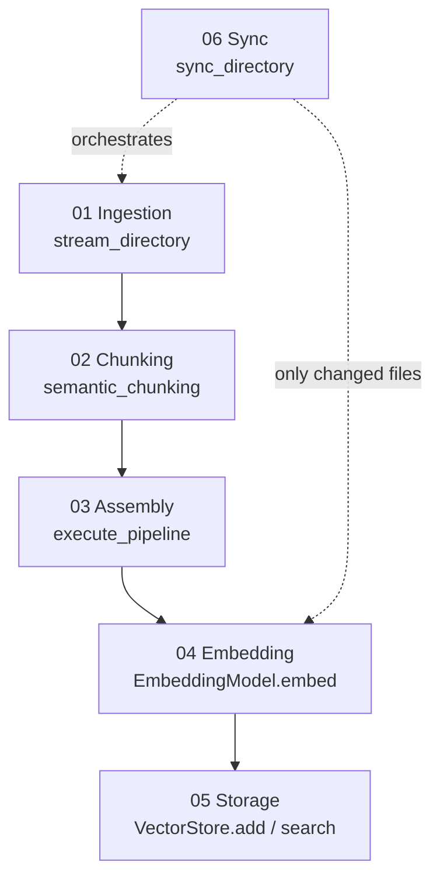

# How it works

RAGMill is six small, independent stages. Each one does a single thing and
hands off a plain data structure to the next, so you can use any stage on its
own.



## 01 — Ingestion

`RAGEngine.stream_directory()` walks a folder with `os.walk` and, for each
supported file, extracts plain text. It's a **generator** — it yields one file
at a time instead of loading the whole folder into memory, so a directory with
10,000 files uses the same memory as one with 10.

| Extension | Read via |
|---|---|
| `.txt` `.md` `.log` `.rst` | direct file read |
| `.pdf` | `pypdf` (the `pdf` extra) |
| `.docx` | `python-docx` (the `docx` extra) |

Parser imports are lazy, so `import ragmill` never requires `pypdf`/`python-docx`.
An unreadable or unsupported file is skipped with a warning instead of killing
the run.

## 02 — Semantic chunking

`RAGEngine.semantic_chunking()` splits one document into chunks of at most
`chunk_size` characters, trying never to cut mid-sentence:

1. **Split on blank lines** into paragraphs; accumulate them into a buffer until
   the next one would overflow `chunk_size`.
2. **Fall back to sentences** when a single paragraph is already too big.

Each time a chunk closes, the last `overlap` characters are carried into the
next chunk so context isn't lost at the boundary. Overlap is character-based
(not word-aware), so it can start mid-word — a deliberate simplicity trade-off.

## 03 — Pipeline assembly

`RAGEngine.execute_pipeline()` ties ingestion + chunking together and returns a
uniform list of payloads regardless of the original file type:

```json
{
  "metadata": {
    "source_file": "/abs/path/report.pdf",
    "filename": "report.pdf",
    "chunk_index": 0,
    "character_length": 480,
    "modified_at": 1737000000.0
  },
  "content": "…the chunk text…"
}
```

## 04 — Embedding

`EmbeddingModel.embed()` turns text into vectors using a quantized ONNX model
(`Xenova/all-MiniLM-L6-v2`, 384 dimensions). It:

1. Tokenizes the text.
2. Runs the ONNX model to get one vector per token.
3. **Mean-pools** across real tokens (padding ignored via the attention mask) →
   one vector per chunk.
4. **L2-normalizes**, so cosine similarity later is a plain dot product.

!!! info "Why ONNX?"
    ONNX Runtime runs the pre-trained model on CPU with no PyTorch/TensorFlow
    and no GPU — a 22 MB file, fully offline after the first download.

!!! note "Memory-bounded batching"
    `embed()` processes texts in small, length-sorted sub-batches rather than
    one giant call. Padding is per-batch, so one long chunk can't force
    thousands of short ones to be padded up — this keeps peak memory flat and
    CPU throughput high no matter how many chunks you pass in.

## 05 — Vector storage

The built-in `SQLiteVectorStore` is deliberately *not* a specialized vector
database — it's a SQLite table plus a brute-force dot-product scan:

```python
vectors = np.stack([np.frombuffer(row.embedding, np.float32) for row in rows])
scores  = vectors @ query_vector          # normalized → dot product = cosine
top     = np.argsort(-scores)[:top_k]
```

For one folder's worth of documents (thousands of chunks) this is fast and
avoids pulling in FAISS or native extensions. `search()` also accepts
`filename`, `source_file`, `modified_after`, and `modified_before` filters that
apply as a SQL `WHERE` *before* scoring, so filtered searches score fewer rows.

For millions of chunks, swap in a cloud backend (Pinecone/Qdrant) behind the
same interface — see [Vector stores](guide/vector-stores.md).

## 06 — Incremental sync

`sync_directory()` is the stateful orchestrator. It stores one SHA-256 hash per
file in a `file_state` table and compares on every run:

| Situation | Action |
|---|---|
| file hash unchanged | **skipped** — never re-chunked or re-embedded |
| file new | chunked, embedded, **added** |
| file content changed | old chunks dropped, re-embedded, **updated** |
| file gone from disk | its chunks **deleted** from the store |

Hashing the *content* (not the modification time) means a `git checkout` that
touches timestamps but changes no text won't trigger needless re-embedding.

---

For a line-by-line trace with real inputs and outputs, see
[`GUIDE.md`](https://github.com/Abdullahbinaqeel/RAGMill/blob/main/GUIDE.md) in
the repository.
