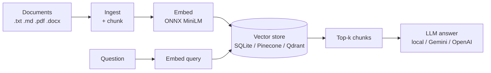

# RAGMill

<p align="center">
<a href="https://pypi.org/project/ragmill/"></a>
<a href="https://pypi.org/project/ragmill/"></a>
<a href="https://github.com/Abdullahbinaqeel/RAGMill/blob/main/LICENSE"></a>
<a href="https://github.com/Abdullahbinaqeel/RAGMill/actions/workflows/ci.yml"></a>
</p>

<p align="center"><em>A lightweight, zero-config local pipeline for AI data ingestion, semantic chunking, embeddings, vector search, and retrieval-augmented chat.</em></p>

!!! tip "Latest release: v0.3.0"
    `pip install ragmill` now ships the full CLI, REST API, retrieval-augmented
    chat, and Pinecone/Qdrant backends. See the [Changelog](changelog.md) for
    everything new.

<div class="grid cards" markdown>

- :material-rocket-launch: **Offline by default**

    No API keys, ever. Embeddings and chat run locally on your machine. Cloud backends are strictly opt-in.

- :material-package-variant-closed: **Zero core dependencies**

    `pip install ragmill` pulls in *nothing*. Everything else is an opt-in extra you add only when you need it.

- :material-file-document-multiple: **Any folder → searchable knowledge base**

    Point it at a directory of `.txt`, `.md`, `.pdf`, or `.docx` files and get semantic search + grounded Q&A.

- :material-swap-horizontal: **Swappable everything**

    Local SQLite or Pinecone/Qdrant in the cloud. Local LLM or Gemini/OpenAI. One env var switches each.

</div>

## What is RAGMill?

RAGMill turns a folder of documents into a searchable, question-answerable
knowledge base. It runs the full Retrieval-Augmented Generation (RAG) pipeline
end to end:



By default the entire pipeline runs on your machine — a small ONNX embedding
model and a local GGUF chat model download once (~1 GB total) to
`~/.cache/ragmill/models`, then never touch the network again.

## 30-second taste

```bash
pip install "ragmill[all]"
ragmill sync ./my_documents      # index a folder
ragmill chat                     # ask questions about it, in your terminal
```

Or from Python:

```python
from ragmill import RAGEngine, SQLiteVectorStore
from ragmill.embeddings import EmbeddingModel
from ragmill.sync import sync_directory

engine, model, store = RAGEngine(), EmbeddingModel(), SQLiteVectorStore("kb.db")
sync_directory("./my_documents", engine, model, store)

qvec = model.embed(["how does chunk overlap work?"])[0]
for hit in store.search(qvec, top_k=3):
    print(round(hit["score"], 3), hit["metadata"]["filename"])
```

## Where to next

- New here? Start with **[Installation](installation.md)** then the **[Quickstart](quickstart.md)**.
- Want to understand the internals? Read **[How it works](concepts.md)**.
- Embedding it in your own app? See **[Use in your project](integration.md)**.
- Running it as a service? See the **[REST API](guide/rest-api.md)** and **[Docker](deployment.md)** guides.

## License

RAGMill is released under the [MIT License](https://github.com/Abdullahbinaqeel/RAGMill/blob/main/LICENSE).
