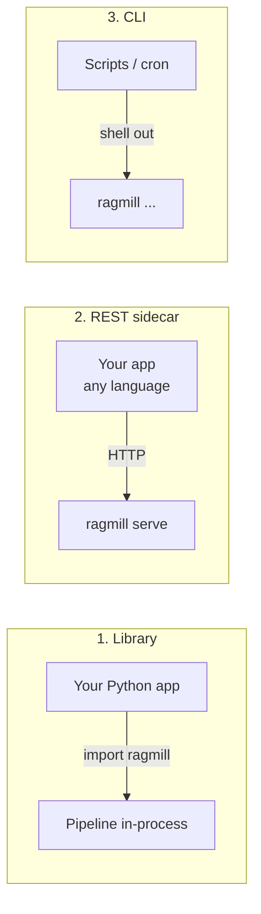

# Use RAGMill in your project

There are three ways to build RAGMill into your own application. Pick based on
how tightly coupled you want it.



## 1. As a Python library (in-process)

Best when your app is Python. Import the pieces you need and drive the pipeline
directly.

```bash
pip install "ragmill[embeddings]"        # + [pdf,docx] for those file types
```

```python
from ragmill import RAGEngine, SQLiteVectorStore
from ragmill.embeddings import EmbeddingModel
from ragmill.sync import sync_directory

# Build these once at startup and reuse them — the model load is expensive.
engine = RAGEngine(chunk_size=500, overlap=50)
model  = EmbeddingModel()
store  = SQLiteVectorStore("app_kb.db")

def reindex(folder: str) -> dict:
    return sync_directory(folder, engine, model, store)

def retrieve(query: str, k: int = 5):
    qvec = model.embed([query])[0]
    return store.search(qvec, top_k=k)
```

Add grounded answers with `generate_answer` (needs a chat extra):

```python
from ragmill.chat import generate_answer

def answer(query: str) -> str:
    return generate_answer(query, retrieve(query))
```

!!! tip "Reuse instances"
    Construct `EmbeddingModel` and the store **once** and hold them for the
    process's lifetime. Re-creating `EmbeddingModel` reloads the ONNX session
    every time. In web frameworks, build them at startup (e.g. FastAPI
    lifespan / a module-level singleton).

### In a FastAPI app

```python
from contextlib import asynccontextmanager
from fastapi import FastAPI
from ragmill import RAGEngine, SQLiteVectorStore
from ragmill.embeddings import EmbeddingModel

ctx = {}

@asynccontextmanager
async def lifespan(app: FastAPI):
    ctx["engine"] = RAGEngine()
    ctx["model"] = EmbeddingModel()
    ctx["store"] = SQLiteVectorStore("app_kb.db")
    yield
    ctx["store"].close()

app = FastAPI(lifespan=lifespan)

@app.get("/ask")
def ask(q: str):
    qvec = ctx["model"].embed([q])[0]
    return {"hits": ctx["store"].search(qvec, top_k=5)}
```

## 2. As a REST sidecar (any language)

Best when your app **isn't** Python (Next.js, Node, Go, mobile). Run RAGMill as
its own service and call it over HTTP.

```bash
pip install "ragmill[server,embeddings,chat]"
export RAGMILL_SQLITE_PATH=/data/ragmill.db
ragmill serve --host 0.0.0.0 --port 8000
```

Then call `/search` or `/chat` from your app — see the
[REST API guide](guide/rest-api.md) for the TypeScript example. Ship it with the
provided [Docker image](deployment.md) for a reproducible sidecar.

## 3. As a CLI (scripts & cron)

Best for glue and scheduled indexing. Shell out to `ragmill`:

```bash
# nightly re-index cron job
export RAGMILL_SQLITE_PATH=/data/ragmill.db
ragmill sync /data/docs && echo "reindexed at $(date)"
```

## Which should I use?

| Your situation | Use |
|---|---|
| Python app, want lowest latency | **Library** |
| Non-Python app, or want isolation | **REST sidecar** |
| Batch/scheduled indexing, glue scripts | **CLI** |

For the exact function signatures, see the [Python API reference](api-reference.md).
